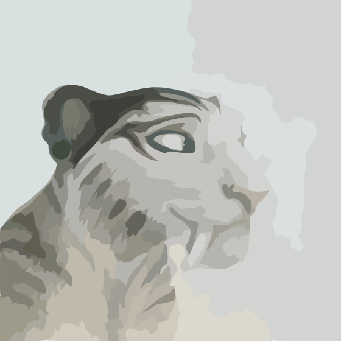

<h1 align="center">shira</h1>
<p align="center"></img></p>
<h6 align="center">A smart music downloader</h6>
<p align="center">
<em>Download music from YouTube, YouTube Music and Soundcloud, </br> with great metadata and little effort.</em>
</p>

## Installation
- Have [python](https://www.python.org/downloads/) (3.11+) and [git](https://git-scm.com/downloads) installed
- Have `ffmpeg` installed ([scoop](#installing-ffmpeg-with-scoop) / [windows downloads](https://www.gyan.dev/ffmpeg/builds/) / [windows mirror](https://github.com/BtbN/FFmpeg-Builds/releases)) and added to PATH, or [specify it with `--ffmpeg-location`](#configuration)/[config](#configuration)
- `git clone https://github.com/KraXen72/shira`, `cd shira`
- `pip install -r requirements.txt`
  
Related: [Using a cookies file (for YT Premium & more)](#setting-a-cookies-file), [Troubleshooting](#troubleshooting)


## Usage Examples
- `python -m shiradl https://music.youtube.com/watch?v=WJapWKmYMHE` **YouTube Music**
- `python -m shiradl "https://music.youtube.com/watch?v=WJapWKmYMHE&list=RDAMPLOLAK5uy_m0j4kNTIii-Ynm-lOSZezFRZVSlAPqgHw"`
- `python -m shiradl https://www.youtube.com/watch?v=eF0Wh78eHyA` **YouTube (video)**
- `python -m shiradl https://soundcloud.com/h1ghplayz-fn/nujabes-aruarian-dance-slowed-reverb-muffled-w-echo` **SoundCloud**
- `python -m shiradl https://music.youtube.com/playlist?list=OLAK5uy_mCSHnOZ5d566LXt_DZFeFINWz2XC-FvEA` **Album/Playlist**
- `python -m shiradl -u ./links.txt` **List of links to download**
  - [See all cli options/flags](#Configuration)

## Goals
- Provide an easy way to download songs form YouTube Music, YouTube or SoundCloud
  - Instead of a GUI/manual input for some steps like in [tiger](https://github.com/KraXen72/tiger), shira requires no additional user input once ran.
- Provide objectively correct or at least very reasonable music metadata & properly tag music files.
  - <ins>objectively correct</ins>: Shira queries the MusicBrainz Database and [YouTube Music's API](https://github.com/sigma67/ytmusicapi) to get song metadata
  - <ins>very reasonable</ins>: When downloading a Youtube video, tags will be inferred from the video info: `title`, `channel_name`, `description`, `upload_date`, etc.

## Tagging
- Adds a lot of metadata to music files. [See full list](#tag-variables). Writes [these tags](https://github.com/OxygenCobalt/Auxio/wiki/Supported-Metadata)
- Embeds proper & multi-value `m4a` (iTunes) and `.mp3` (ID3v2.4) tags
- Uses [YouTube Music's API](https://github.com/sigma67/ytmusicapi) to get info about songs
- Uses [MusicBrainz API](https://musicbrainz.org/doc/MusicBrainz_API) to resolve MusicBrainz ID's from their api 
  - `track`, `album`, `artist`, `albumartist` ids
    - falls back to `artist`, `albumartist` (sometimes artist exists in MusicBrainz DB but particular song doesen't)
- uses my custom smart-metadata system from [tiger](https://github.com/KraXen72/tiger) for non-music videos
  - collects as much information as possible for each tag, and selects the value with most occurences (with fallbacks)
- Cleans up messy titles into more reasonable ones:
  - `IDOL【ENGLISH EDM COVER】「アイドル」 by YOASOBI【Aries Shepard x @djJoMusicChannel 】` =>
  - `IDOL [ENGLISH EDM COVER] [アイドル] by YOASOBI`
- Is smart about turning a video's thumbnail into a square album cover
  
<details id="smartcrop">
<summary>More info about YouTube thumbnail to Album Art algorithm</summary>
<ol>
<li>samples 4 pixels near the corners of the thumbnail (which is first smoothed and reduced to 64 colors)</li>
<li>decides to crop if average of standard deviations of r, g and b color channels from each sample point is lower than a than a treshold</li>
<li>otherwise pads the image to 1:1 with it's dominant color</li>
</ol>
</details>

## About & Credits
- Name: **Shira** is a female saber-toothed [tiger](https://github.com/KraXen72/tiger) from [Ice Age](https://iceage.fandom.com/wiki/Shira). The name means ['poetry', 'singing' or 'music'](https://www.wikiwand.com/en/Shira_(given_name)) in Hebrew.
- Based on my previous [YouTube downloader tiger](https://github.com/KraXen72/tiger) and [Glomatico's YouTube Music Downloader](https://github.com/glomatico/gytmdl)
- Project logo is this [DeviantArt fanart](https://www.deviantart.com/f-a-e-l-e-s/art/Ice-age-5-Shira-and-Diego-757174602), which has been modified, vectorised and cleaned up

## Configuration
Shira can be configured using the command line arguments or the config file.  
The config file is created automatically when you run shira for the first time at `~/.shiradl/config.json` on Linux and `%USERPROFILE%\.shiradl\config.json` on Windows. Config file values can be overridden using command line arguments.

| Command line argument / Config file key | Description | Default value |
| --- | --- | --- |
| `-f`, `--final-path` / `final_path` | Path where the downloaded files will be saved. | `./YouTube Music` |
| `-t`, `--temp-path` / `temp_path` | Path where the temporary files will be saved. | `./temp` |
| `-c`, `--cookies-location` / `cookies_location` | Location of the cookies file. | `null` |
| `--ffmpeg-location` / `ffmpeg_location` | Location of the FFmpeg binary. | `ffmpeg` |
| `--config-location` / - | Location of the config file. | `<home folder>/.shiradl/config.json` |
| `-i`, `--itag` / `itag` | Itag (audio quality/format). [More info](#itags) | `140` |
| `--cover-size` / `cover_size` | Size of the cover.  `size >= 0` and `<= 16383` | `1200` |
| `--cover-format` / `cover_format` | Format of the cover. `jpg` or `png` | `jpg` |
| `--cover-quality` / `cover_quality` | JPEG quality of the cover.  [1<=x<=100] | `94` |
| `--cover-img` / `cover_img` | Path to image or folder of images named video/song id  | `null` |
| `--cover-crop` / `cover_crop` |  'crop' takes a 1:1 square from the center, pad always pads top & bottom. `auto`, `crop` or `pad` | `auto` - [more](#smartcrop) |
| `--template-folder` / `template_folder` | Template of the album folders as a format string. | `{album_artist}/{album}` |
| `--template-file` / `template_file` | Template of the song files as a format string. | `{track:02d} {title}` |
| `-e`, `--exclude-tags` / `exclude_tags` | List of tags to exclude from file tagging separated by commas without spaces. | `null` |
| `--truncate` / `truncate` | Maximum length of the file/folder names. | `40` |
| `-l`, `--log-level` / `log_level` | Log level. | `INFO` |
| `-s`, `--save-cover` / `save_cover` | Save cover as a separate file. | `false` |
| `-o`, `--overwrite` / `overwrite` | Overwrite existing files. | `false` |
| `-p`, `--print-exceptions` / `print_exceptions` | Print exceptions. | `false` |
| `-u`, `--url-txt` / - | Read URLs as location of text files containing URLs. | `false` |
| `-n`, `--no-config-file` / - | Don't use the config file. | `false` |
| `-w`, `--single-folder` / - | Wrap singles in their own folder instead of placing them directly into artist's folder. | `false` |

### Itags
The following itags are available:
- `140` (128kbps AAC) - default, because it's the result of `bestaudio/best` on a free account
- `141` (256kbps AAC) - use if you have premium alongside `--cookies-location`
- `251` (128kbps Opus) - most stuff will error with `Failed to check URL 1/1`. Better to use `140`
  
SoundCloud will always download in 128kbps MP3
- SoundCloud also offers OPUS, which is currently not supported. [Some people were complaining](https://www.factmag.com/2018/01/04/soundcloud-mp3-opus-format-sound-quality-change-64-128-kbps/) that the quality is worse  
- [These are questionable claims](https://old.reddit.com/r/Techno/comments/bzodax/soundcloud_compression_128kbps_mp3_vs_64_kbps/) at best, but better safe than sorry.   

### Tag variables
The following variables can be used in the template folder/file and/or in the `exclude_tags` list:  
`title`, `album`, `artist`, `album_artist`, `track`, `track_total`, `release_year`, `release_date`, `cover`, `comment`, `lyrics`, `media_type`, `rating`, `track`, `track_total`, `track_mbid`, `album_mbid`, `artist_mbid`, `album_artist_mbid`

### Cover formats
Can be either `jpg` or `png`.

### Cover img
- Pass in a path to an image file, and it will get used for all of the songs you're currently downloading.
- Pass in a path to a folder, and the script will use the first image matching the song/video id and of jpeg/png format as a cover
  - You don't have to create covers for all songs in the playlist/album/etc. you're downloading.
  - SoundCloud will also consider images based on the URL slug instead of id
  - for example: `https://soundcloud.com/yatashi-gang-63564467/lovely-bastards-yatashigang` => `lovely-bastards-yatashigang.jpg` or `.png`

## Troubleshooting
- `python: No module named shiradl` 
  - Make sure you are not already in the `shiradl` directory, e.g. `/shira/shiradl`. if yes, move up one directory with `cd ..` and retry.
- I really need to run this on `python` 3.8+ and updating to 3.11+ is not an option
  - run `pip install typing-extensions` and modify `tagging.py` accordingly:
  ```diff
  - from typing import NotRequired, TypedDict
  + from typing_extensions import NotRequired, TypedDict
  ```

### Installing ffmpeg with scoop
- Scoop is a package manager for windows. It allows easy installing of programs and their updating from the commandline.
- Install [scoop](https://scoop.sh) by running a powershell command (on their website)
- Run `scoop install main/ffmpeg`
- Scoop automatically adds it to path. you can update ffmpeg by doing `scoop update` and `scoop update ffmpeg`/`*`

### Setting a cookies file
- By setting a cookies file, you can download age restricted tracks, private playlists and songs in 256kbps AAC if you are a premium user.
- You can export your cookies to a file by using this [Google Chrome extension](https://chrome.google.com/webstore/detail/gdocmgbfkjnnpapoeobnolbbkoibbcif) or [Firefox extension](https://addons.mozilla.org/en-US/firefox/addon/cookies-txt/) on `https://music.youtube.com`
